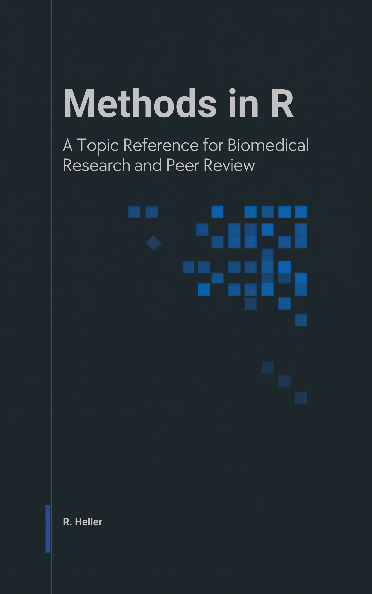

<p align="center">
  <a href="https://r-heller.github.io/methods-in-r/">
    
  </a>
</p>

# Methods in R

*A topic reference for biomedical research and peer review.*

A free, open-source book by **Raban Heller**.

## Read it online

📖 **<https://r-heller.github.io/methods-in-r/>**

## Download

- 📄 [Whole book (PDF)](https://r-heller.github.io/methods-in-r/methods-in-r.pdf)
- 📚 [EPUB](https://r-heller.github.io/methods-in-r/methods-in-r.epub)
- 📑 Per-chapter PDFs: every chapter has a download button at the top of its page.

## What this book covers

The R/biostatistics shelf has plenty of linear textbooks. This one is shaped
for two readers it expects to serve in the same week: the **author** who has
data in front of them and needs to pick a method, run it in R, and write the
Methods paragraph; and the **peer reviewer** who has a manuscript on their
desk and needs to know — for the method the authors used — what a competent
application looks like, which diagnostics should have been reported, and what
red flags to flag.

Every method page therefore ends with a *For Reviewers* section: the
misapplications, the missing diagnostics, the red flags in tables and figures,
and the things to verify against the authors' references and arithmetic. A
final part, *Reporting Templates*, gives copy-paste Methods and Results
paragraphs tagged with **STROBE / CONSORT / TRIPOD-AI / PRISMA / ARRIVE**.

The book covers 16 topic areas — from foundations and inference through
regression, survival, Bayesian methods, machine learning, bioinformatics, and
study design — with hands-on labs that consolidate the methods of each area
into a single runnable file.

## Sources consolidated

- [`CTTIR/courses`](https://github.com/CTTIR/courses) — earlier lab
  materials that inspired the worked examples here. Re-homed by topic.
- [`CTTIR/tutorials`](https://github.com/CTTIR/tutorials) — earlier
  method pages written to a 9-section template; extended here with a
  10th section, *For Reviewers*.

Both source repositories are MIT-licensed and authored by R. Heller.

## How to cite

> Heller, R. (`2026`). *Methods in R: A Topic Reference for Biomedical
> Research and Peer Review.* <https://r-heller.github.io/methods-in-r/>.

BibTeX:

```bibtex
@book{heller2026methods,
  author    = {Heller, Raban},
  title     = {Methods in R: A Topic Reference for Biomedical Research and Peer Review},
  year      = {2026},
  publisher = {Self-published via GitHub Pages},
  url       = {https://r-heller.github.io/methods-in-r/}
}
```

## Reproducibility

Built with [bookdown](https://bookdown.org/), R, and `renv`. To rebuild
locally:

```bash
git clone https://github.com/r-heller/methods-in-r.git
cd methods-in-r
R -e 'renv::restore()'
R -e 'bookdown::render_book("index.Rmd", output_format = "all")'
```

## Sibling volume

This is the second book in the *…in R* series. The first is
[`r-heller/strategy-in-r`](https://github.com/r-heller/strategy-in-r) —
*Strategy in R: Game Theory, Simulation, and Machine Intelligence*.

## License

- Source code: [MIT](LICENSE)
- Written content: [CC BY-SA 4.0](LICENSE-CONTENT) — attribution to *R. Heller, Methods in R*.

## Contributing

Issues and PRs welcome — see [CONTRIBUTING.md](CONTRIBUTING.md) or open an
issue at <https://github.com/r-heller/methods-in-r/issues>.
